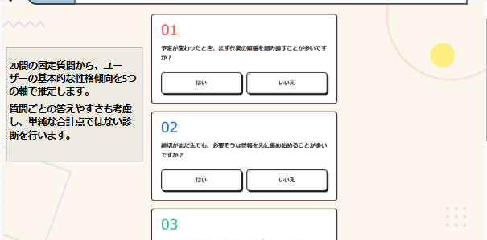
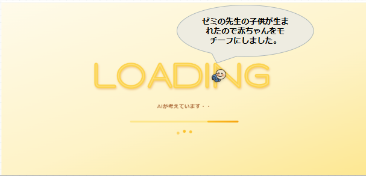
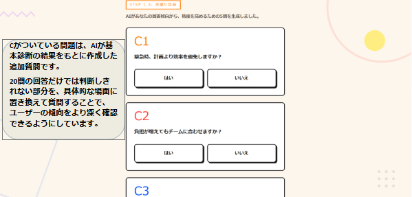
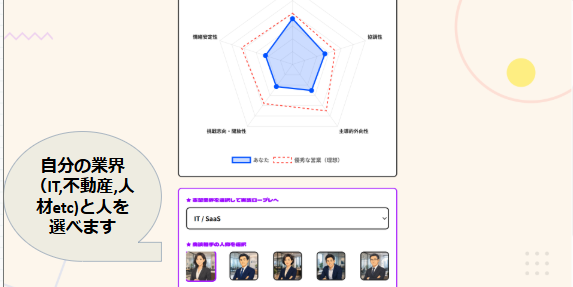
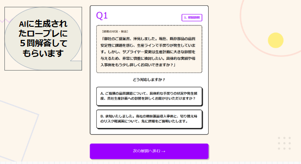

# IRTappp

## 概要

IRTappp は、IRT（項目応答理論）を用いた営業適性診断と、AI による営業ロールプレイを組み合わせた Web アプリケーションです。

ユーザーは営業職に関する質問に「はい／いいえ」で回答し、その結果から以下の5つの特性を推定します。

* 計画性・誠実性
* 協調性
* 主導的外向性
* 挑戦志向・開放性
* 情緒安定性

これらの評価軸は、性格特性を5つの因子で捉える Big Five / Five-Factor Model の考え方を参考にし、営業職への自己理解支援に合わせて独自に再構成したものです。

診断後は、推定された特性に基づいて AI が追加質問や営業ロールプレイのシナリオを生成し、営業適性や強みを分析します。

## 主な機能

* IRT / Rasch モデルによる特性値の推定
* 営業適性スコアの算出
* AI による深掘り質問の生成
* 志望業界に応じた営業ロールプレイ
* レーダーチャートによる診断結果の可視化
* 最終フィードバックの生成

## 使用技術

* Python
* Flask
* NumPy
* Google Gemini API
* Chart.js
* HTML / CSS / JavaScript
* Google Fonts
* React

## 実行方法

必要なライブラリをインストールします。

```bash
pip install flask numpy google-generativeai
```

Gemini APIキーを設定します。

```python
genai.configure(api_key="")
```

上記の `api_key` に、自分のローカル環境で取得した Gemini APIキーを設定してください。

アプリを起動します。

```bash
python a1010.py
```

起動後、ブラウザで以下にアクセスします。

```text
http://127.0.0.1:5000
```

## 注意事項

* Gemini API を使用するため、APIキーが必要です。
* APIキーは公開リポジトリにアップロードしないでください。
* 本アプリの診断結果は、Big Five の考え方を参考にした独自の簡易診断であり、正式な心理検査や採用判断を目的としたものではありません。
* 本アプリで使用している質問項目や IRT パラメータは、ハッカソン用の仮想データに基づくものです。

## 画面イメージ

### 基本診断画面

20問の固定質問に回答し、ユーザーの基本的な性格傾向を推定します。



### ローディング画面

AI が回答傾向をもとに、深掘り質問やロールプレイの内容を生成します。



### 深掘り診断画面

基本診断の結果をもとに、AI が追加質問を生成します。
20問だけでは判断しにくい部分を、具体的な場面に置き換えて確認します。



### 診断結果画面

IRT / Rasch モデルにより推定した5つの特性を、レーダーチャートで可視化します。
また、志望業界と商談相手を選択し、AIロールプレイに進みます。



### AIロールプレイ画面

AI が生成した営業ロールプレイに対して、選択式で回答します。
実際の営業場面を想定し、対応力や判断の傾向を確認します。



### 最終フィードバック画面

診断結果とロールプレイをもとに、AI が総合的なアドバイスを生成します。


## 参考・引用 / References

本プロジェクトでは、以下の資料・ドキュメントを参考にしました。

### AI × Growth Hackathon

* AI × Growth Hackathon. “開会式資料.”

本プロジェクトは、AI × Growth Hackathon に参加した際に制作したアプリケーションです。

ハッカソンでは、Gemini API を活用し、個人や社会が一歩前に進むためのプロダクトを開発することがテーマとして示されました。
本アプリではその趣旨に基づき、AI にすべてを代行させるのではなく、ユーザー自身の自己理解や行動のきっかけを広げることを目的として、営業適性診断とAIロールプレイを組み合わせました。

また、Gemini API はハッカソン内で配布されたAPIキーを利用して開発しました。
APIキーは公開リポジトリには含めず、ローカル環境でのみ設定する想定です。


### Gemini API

* Google AI for Developers. “Gemini API Documentation.”
  https://ai.google.dev/gemini-api/docs

本アプリでは、Gemini APIを用いて、ユーザーの診断結果に応じた追加質問や営業ロールプレイのシナリオ生成を行いました。

### Flask

* Pallets Projects. “Flask Documentation.”
  https://flask.palletsprojects.com/

本アプリのWebアプリケーション部分は、Pythonの軽量Webフレームワークである Flask を用いて実装しました。

### Chart.js

* Chart.js. “Chart.js Documentation.”
  https://www.chartjs.org/docs/latest/

診断結果の可視化には、Chart.js を用いてレーダーチャートを表示しました。

### Google Fonts

* Google Fonts. “Noto Sans JP.”
  https://fonts.google.com/noto/specimen/Noto+Sans+JP

* Google Fonts. “Dela Gothic One.”
  https://fonts.google.com/specimen/Dela+Gothic+One

本アプリのUIでは、Google Fonts を用いて日本語表示用フォントを読み込んでいます。

### Big Five / Five-Factor Model

* John, O. P., & Srivastava, S. “The Big Five Trait Taxonomy: History, Measurement, and Theoretical Perspectives.”
  https://pages.uoregon.edu/sanjay/pubs/bigfive.pdf

* Goldberg, L. R. “The Development of Markers for the Big-Five Factor Structure.” Psychological Assessment, 1992.

本プロジェクトでは、性格傾向を複数の軸で捉える考え方として、Big Five / Five-Factor Model を参考にしました。

ただし、本アプリで使用している質問文や5つの軸は、既存の Big Five 尺度をそのまま使用したものではなく、ハッカソン用に営業職への自己理解支援に合わせて独自に作成したものです。

### IPIP / Personality Scale Scoring

* International Personality Item Pool. “IPIP Scale Scoring Instructions.”
  https://ipip.ori.org/newScoringInstructions.htm

性格検査における、順方向項目・逆転項目の点数化や尺度得点の集計方法の参考にしました。

本プロジェクトでは、IPIP の質問項目文を直接利用していません。順方向項目・逆転項目を処理する考え方のみを参考にしています。

### Item Response Theory / Rasch Model

* Chen, Y., Li, X., Liu, J., & Ying, Z. “Item Response Theory -- A Statistical Framework for Educational and Psychological Measurement.”
  https://arxiv.org/abs/2108.08604

* Rasch Model.
  https://en.wikipedia.org/wiki/Rasch_model

本プロジェクトでは、項目応答理論（IRT）および Rasch モデルの考え方を参考にしました。

20問の固定質問に対する回答から、ユーザーの性格傾向を推定するために、質問ごとの答えやすさを考慮する仕組みを実装しています。

### Python Libraries

* NumPy
  https://numpy.org/

本アプリでは、回答データの処理や Rasch モデルに基づく特性値推定の数値計算に NumPy を使用しました。

* pandas
  https://pandas.pydata.org/

* SciPy
  https://scipy.org/

仮想データの生成や Rasch モデルに基づく項目パラメータ推定を検討する際に参考にしました。

## 著作権・ライセンスに関する注意

本プロジェクトで使用した質問文は、既存の性格検査尺度をそのまま転載したものではなく、ハッカソン用に独自に作成したものです。

また、Big Five や IRT、Rasch モデルは理論的枠組みとして参考にしたものであり、特定の商用検査や既存尺度の診断結果を再現することを目的としていません。

本アプリの診断結果は、医学的・心理学的な診断を目的としたものではありません。
自己理解や営業職への向き合い方を考えるための参考情報として利用することを想定しています。

## データに関する注意

本プロジェクトで使用した営業職500人分の回答データは、実在する営業職の回答データではなく、ハッカソン用に生成した仮想データです。

そのため、本データから推定した項目パラメータは、実データで検証済みのものではありません。
今後、実際の回答データを蓄積することで、より妥当性の高いパラメータ推定を行うことができます。

## APIキーに関する注意

Gemini APIキーなどの認証情報は、GitHub上に公開しないでください。
`.env` ファイルや環境変数で管理し、リポジトリには含めないようにしてください。
